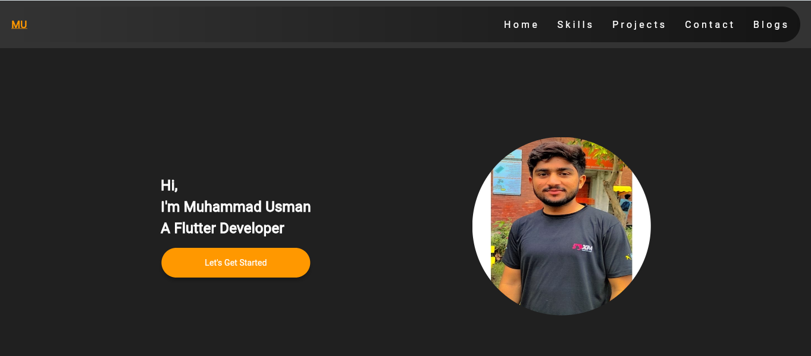
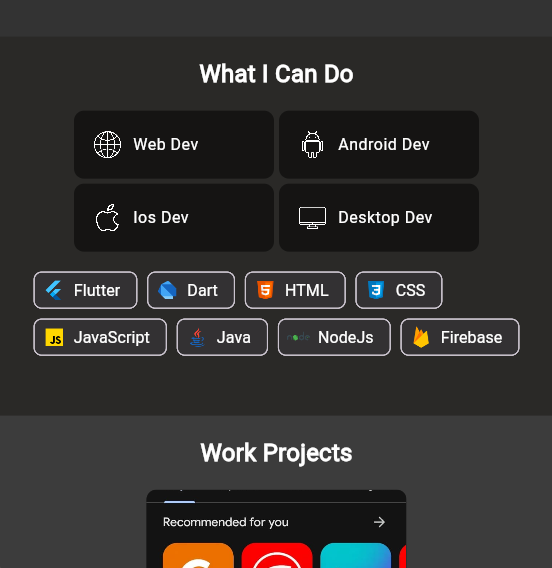

# Flutter Responsive Portfolio Website

Welcome to my Flutter-powered portfolio showcasing my skills, projects, certifications, and contact details — all wrapped in a responsive and beautifully animated UI.
## Live Demo

You can explore the live version of the website [Click to see live demo](https://usmanalidev.netlify.app/#/).

## Screenshots

## Table of Contents

- [Key Features](#key-features)
- [Technologies and Packages Used](#technologies-and-packages-used)
- [Getting Started](#getting-started)
- [Contact Me](#contact-me)

## Key Features

- **Responsive Design:** The portfolio website is meticulously designed to provide a consistent and visually pleasing experience across a wide variety of devices. Whether you're accessing the website on a large desktop screen, a laptop, a tablet, or a small Android smartphone, the layout and content will adapt gracefully to ensure optimal usability.

- **Project Showcase:** The heart of the portfolio lies in its project showcase. Each project is presented with a captivating card that provides a glimpse of the project's essence. Visitors have the option to click on these cards to delve deeper into the details of each project. Furthermore, a direct link to the corresponding GitHub repository allows visitors to explore the codebase and gain a comprehensive understanding of the project's technical aspects.

- **Contact and Interaction:** To facilitate easy communication, the portfolio provides multiple avenues to get in touch with me. The contact section features information such as my email address, LinkedIn profile, and Twitter handle. Whether you're a potential collaborator, an employer, or just someone interested in connecting, I'm always open to meaningful conversations.

- **Elegant UI and Animations:** The user interface of the portfolio is thoughtfully designed to not only be functional but also visually appealing. Subtle animations are integrated throughout the website to create an engaging and delightful browsing experience. These animations are carefully balanced to enhance user engagement without overwhelming the content.

## Technologies and Packages Used

The portfolio website is built using Flutter, a powerful open-source UI software development toolkit. The following packages were utilized to enhance various aspects of the website:

- [google_fonts](https://pub.dev/packages/google_fonts): Incorporates visually appealing and readable fonts from the Google Fonts library into the website.
- [flutter_svg](https://pub.dev/packages/flutter_svg): Enables the seamless integration and rendering of SVG images, ensuring high-quality graphics across all devices.
- [get](https://pub.dev/packages/get): Empowers efficient state management, simplifying the process of handling and updating UI components.
- [photo_view](https://pub.dev/packages/photo_view): Provides an elegant and user-friendly image viewer for an enhanced visual experience.
- [url_launcher](https://pub.dev/packages/url_launcher): Enables easy integration with external links, allowing visitors to quickly navigate to external resources.
- [font_awesome_flutter](https://pub.dev/packages/font_awesome_flutter): Introduces a wide variety of customizable icons from the FontAwesome library, enhancing the visual representation of the website's features.

## Contact Me

Your feedback and thoughts are highly valued. Feel free to connect with me through:

- **Email:** usmanalidev07@gmail.com
- **LinkedIn:** [Muhammad Usman](https://www.linkedin.com/in/muhammad-usman1214/)

---

### Designed and developed with ❤️ by [Muhammad Usman](https://www.linkedin.com/in/muhammad-usman1214/).please give like this but in short form using specific keyword?
